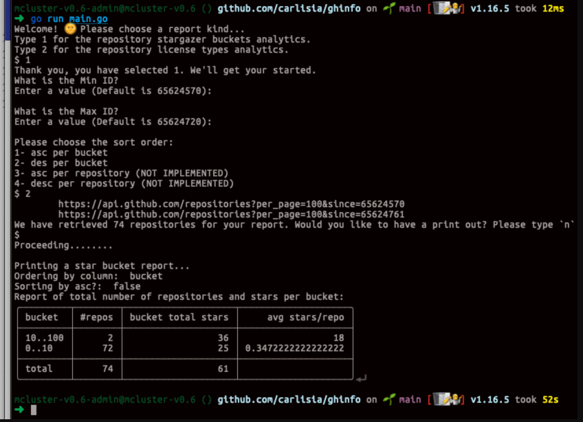
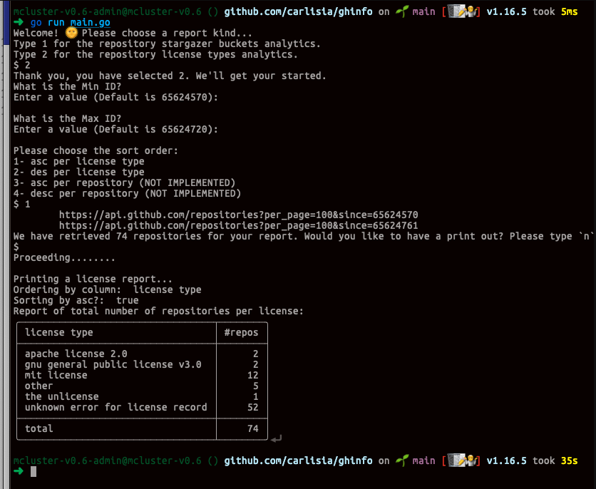

# ghinfo

## What this system does

This is a CLI app that fetches a list of GH public repositories. It returns a curated list of all repositories starting at a the specified repository ID and ending at the specified repository maximum ID..

It also fetches the associated star count and license type per repository.

Running the app via the terminal will provide the prompts to print the available reports.

## Steps to run:

- git clone the source
- set an enviroment variable named `GH_TOKEN` to a GH personal access token
- run `go mod tidy`
- at the root of the project, run `go run main.go`

## Screenshots

### Stargazers report, sorted by bucket tiers and in descending order

### License type report, sorted by license type and in ascending order
